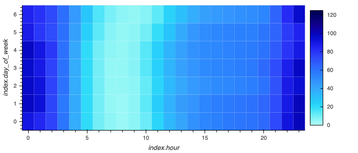

# TimeSeries-Analysis-MercadoLibre

## Summary

[MercadoLibre](https://mercadolibre.com/) is the largest and most popular online marketplace in Latin America. in this notebook, we will analyze the company's financial and tie it to google search traffic data. through this analysis we will attempt to do the following tasks:

- Identify seasonal patterns in google search traffic data.
- Evaluate how the company stock price correlates to google search traffic and its seasonality if any.
- Utilized a time series model to forecast hourly user search traffic.
- Utilized the same model to forecast the company's future stock price.

for the forecasting part we will be using [Facebook Prophet](https://facebook.github.io/prophet/).

## Insights Gathered

- There was a 7.78% increase in searches for May 2020 and a difference of 2670 searches compared to the median of the the same year 2020.
- There is no clear distinction for any daily concentrated effects of the week however we can clearly see that between the hours odf 5 to 10 there is a lower number of searches ( work times ).
  
- Investigating the first half of 2020 we for both search trends and stock price , we see no clear if any corelation between the two as the stock price was rising while search trends seem to be flat and with no change in trend.
  
